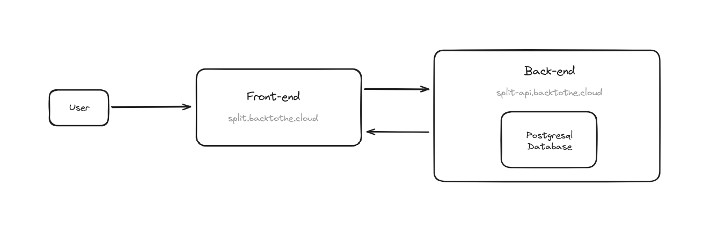
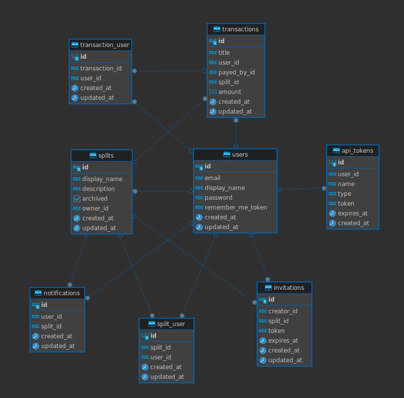

<h1>

SPL!T - Technical Document Architecture
</h1>

**SPL!T** is a [tricount](https://www.tricount.com/) clone developed in [React](https://react.dev/) and [AdonisJS](https://adonisjs.com/). Simplify sharing expenses between friends with a user-friendly and secure interface with SPL!T.

## Features

The application offers an effective experience for simplifying group expense management. Users can sign up simply by creating an account with their email address and a password that will be encrypted in the database, before diving into a full range of features to facilitate financial collaboration between group members.

The main features :

- **Registration and Login** : Secure account creation with e-mail address and password, followed by a quick login to the application.
- **Split Management** : Create, rename, describe and delete "splits" to organise group spending.
- **Splits Invitation** : Use unique invitation codes to join existing splits.
- **Member Management** : Add members to a group using an exclusive invitation code.
- **Expense Creation and Allocation** : Ability to create expenses, allocate them to one person or several, and view expense history.
- **Financial View** : View amounts spent individually, group totals and balances between members.
- **Profile Customisation** : Change nickname, start a split, delete a split, and delete the account for a completely personalised user experience.

## Stack

The choice of technology stack for my project is based on a synergy between different technologies, each offering specific advantages. In particular, I opted to use [React.js](https://react.dev/), a JavaScript framework renowned for its flexibility and performance. I chose React because of its large community of developers and its ability to facilitate the development of complex applications.

For the backend, I chose [AdonisJS](https://adonisjs.com/), a [Node.js](https://nodejs.org/) framework that offers an MVC architecture for efficient project management, with pre-built structures for APIs and complete web applications. Its easy authentication integration, package support, switch to TypeScript, robust SQL ORM, advanced router, and emphasis on security make it a powerful choice.

I opted for [Tailwind CSS](https://tailwindcss.com/) for its rapid development with utility classes, making it easy to customise if you're already familiar with CSS. The small size of the production files, the ease with which CSS users can learn, and the comprehensive documentation also influenced this choice.

Finally, I chose to use [PostgreSQL](https://www.postgresql.org/) for my database, a robust relational database management system, because I was comfortable with it.

## Architecture

The architecture of the project is based on a three-tier approach, providing an organised and efficient structure. 

The frontend is the first layer, where users interact directly with the user interface.

The backend, or API layer, forms the second part of the architecture. It manages the business logic, processes requests from the front end via a RESTful API, and communicates with the database to retrieve or store data. This approach guarantees a clear separation of responsibilities and optimum management of CRUD operations.

Finally, the database, the third layer, persistently stores the necessary data. Eelle ensures that information is managed reliably and efficiently, in line with project requirements.

This three-tier architecture offers not only a clear division of components, but also greater flexibility and scalability. It facilitates maintenance and independent updates, and guarantees a consistent and responsive user experience.

## Informations

### Frontend

The main folder, "components", forms the heart of the user interface with its meticulous organisation. Inside, the "dropdown" folder groups together all the components associated with the drop-down menus, ensuring fluid navigation. Layouts" include various elements such as buttons, input fields with labels, and compositions of several components to simplify the creation of complex user interfaces. The 'modal' folder centralises all modal windows, enhancing the user experience by associating them with specific actions. In addition, the 'navbar' folder distinguishes between two types of navigation bar, adapted to the home page and the application. Finally, the 'utils' folder brings together practical components to avoid any redundancy in the design of the home page.

At the same time, the 'context' folder plays an essential role in hosting the application's 'providers'. These include a context dedicated to the logged-in user and another linked to the current group. This structure facilitates the management of reports and the exchange of crucial information within the application.

In addition to the components, the 'pages' folder groups together all the pages in the application, providing a clear view of navigation and overall organisation. In the 'queries' folder, the methods for making requests to the API are grouped together, facilitating access to the necessary data. Finally, the 'styles' folder references the different types of inputs and buttons used, contributing to harmonious management of the visual presentation.

### Backend

The routes are listed in the "routes.ts" file, providing an overview of the available access points. The request management logic is encapsulated in the controllers, which can be accessed in the dedicated 'Controllers' folder. The database models, defining the data structure, can be consulted in the 'Models' file. Finally, the migrations required to create and update the database can be explored in the 'Migrations' folder. These backend elements provide clear visibility of the structure, logic and evolution of the database, making it easier to understand the project as a whole.

## Post-mortem

In terms of organisation and time management, I managed to maintain a constant discipline by working regularly on the project throughout the month. My investment was significant, not least because of the learning curve given that this was my first individual project. Working solo, the organisational aspect was particular, but I was able to adapt to achieve my objectives.

However, one of the major shortcomings was my initial concentration on the visual aspect of the project to the detriment of implementing the functionalities required by the specifications. Perhaps a lesson to be learnt is to prioritise essential functionality before the aesthetic aspect, and possibly to consider backend development before the frontend to ensure a solid foundation.

As my first individual project, I recognise that the code didn't reach best practice. However, it has been a learning experience, and I plan to gradually improve by adopting best practice as I become more familiar with these technologies.

For the future, a re-evaluation of the database and the organisation of the project code is envisaged, as it doesn't suit me. Features such as the integration of profile and group photos, an offline mode, a refund system, the possibility of inviting several people simultaneously, improvements in group management, registration validation and password modification by email should be added. I would also have liked to set up a CI/CD that could have automated the testing, construction and deployment processes, thus ensuring better code quality and smoother production releases, but I wasn't able to do this due to lack of time.

Overall, I'm proud of what this project has achieved. It was an opportunity to learn fascinating technologies such as React and AdonisJS, pushing my limits, especially on the backend where I had little experience. The realisation of the application in line with my design [Figma](https://www.figma.com/file/Dp3djA8k3asWTRKsgEdln1/SPL!T?type=design&node-id=0%3A1&mode=design&t=NKRwCvGsvzrizcpb-1) was rewarding. What's more, I acquired skills in dockerization with [Docker](https://hub.docker.com/u/rapidement) and deployment with Kubernetes, making the experience even richer.

## Dependencies

Dependency management is crucial to ensuring the stability and consistency of the project. The libraries and modules I've integrated play an essential role in the smooth running of the application.

Among the dependencies, I chose [ViteJS](https://vitejs.dev/) as a fast build tool. Its compilation time contributes to a smooth development experience. [React DOM](https://www.npmjs.com/package/react-dom) is an essential dependency for rendering React components in the browser, ensuring efficient user interaction.

Navigation management is facilitated by [React Router DOM](https://www.npmjs.com/package/react-router-dom), offering a way of defining routes and navigating between different views of the application. [React Scroll](https://www.npmjs.com/package/react-scroll) has been specifically integrated to improve navigation on the home page, providing a more engaging user experience.

For form management, [React Hook Form](https://react-hook-form.com/) simplifies data collection and validation, while [React Hot Toast](https://react-hot-toast.com/) displays responsive notifications to the user in an elegant way.

Communication with the backend is managed by [Axios](https://axios-http.com/docs/intro), simplifying the management of HTTP requests. Finally, the integration of [Prettier](https://prettier.io/) + [Prettier for tailwind](https://github.com/tailwindlabs/prettier-plugin-tailwindcss) helps to maintain a clean and uniform code base, improving readability.

To complement my technology stack, I've integrated two additional libraries to enhance the user experience. Firstly, [Headless UI](https://headlessui.com/) offers fully accessible interface components, with no predefined styles, designed to integrate seamlessly with Tailwind CSS. This allows complete customisation while ensuring optimum accessibility.

At the same time, I opted for [Heroicons](https://heroicons.com/), a collection of SVG icons designed by the creators of Tailwind CSS. These icons add an aesthetic touch to the user interface without compromising consistency with the Tailwind CSS style.